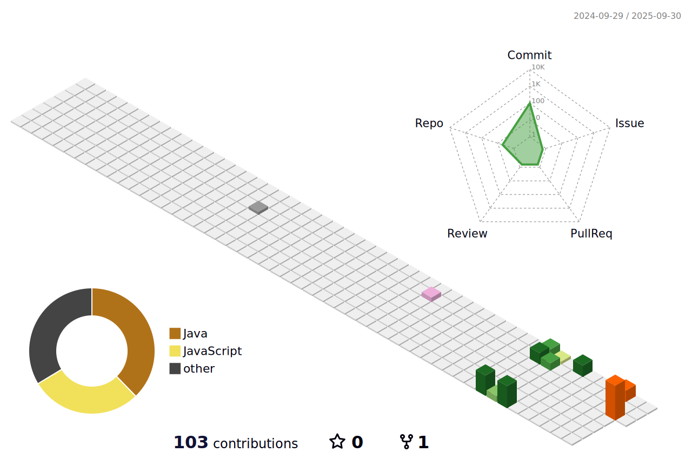

# Welcome to my Github Profile

<!--
**ruanfreits/ruanfreits** is a ✨ _special_ ✨ repository because its `README.md` (this file) appears on your GitHub profile.

Here are some ideas to get you started:
-->
Here it's where I share my codes, dreams and projects.
As a developer I worked using the stack Javascript with Node.js, and working as a Devops/SRE I get imersive into create proejects using CloudFormation and Terraform.
Nowadays I have my main project WorkoutPlatform using the stack SpringBoot-Java with React-Javascript. I hope you get knowledgement rich cloning and reading my repositories.
If you wanna to create something, contact with me by my social medias.
 

<table>
  <tr>
    <td>
      
    </td>
    <td>
      
    </td>
  </tr>
</table>

## 🏅 Certificações 

